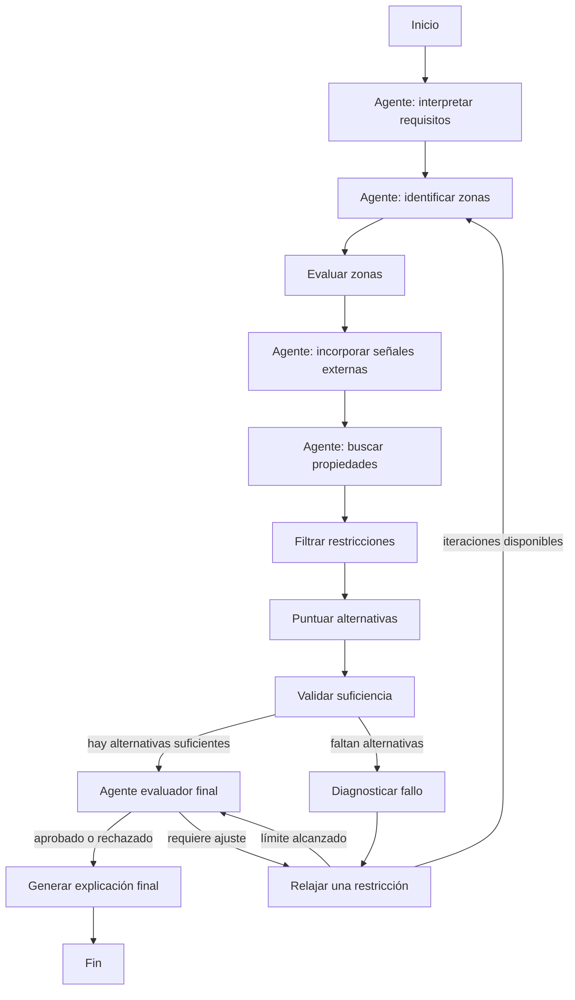

Sistema Inteligente de Recomendación de Vivienda
Instructions
El objetivo de este proyecto es diseñar un sistema inteligente capaz de recomendar opciones de vivienda para una familia en una ciudad, a partir de un conjunto inicial de preferencias (explícitas o implícitas). El sistema deberá integrar: a) Preferencias del usuario (precio, área, tipo de inmueble, etc.), b) Información de zonas o barrios, c) Señales externas (por ejemplo, noticias o contexto urbano), d) Fuentes de oferta inmobiliaria. El reto principal no es únicamente consultar datos, sino estructurar un proceso de decisión iterativo bajo incertidumbre, en el cual es posible que las condiciones iniciales no conduzcan directamente a una solución.
Restricción fundamental de diseño: No se recomienda implementar el sistema como un único agente autónomo que controle todo el proceso. Hacerlo de esa manera: a) reduce la interpretabilidad, b) dificulta el control del flujo y c) impide entender por qué se tomaron ciertas decisiones. El sistema debe diseñarse como un proceso estructurado compuesto por etapas claras, conectadas mediante un grafo de decisión

Patrón arquitectónico requerido
Se espera que el sistema esté basado en un patrón basado en un grafo de estados / flujo de decisión basado en LangGraph. El diseño debe permitir descomponer el problema en actividades diferenciadas con la definición de transiciones condicionales entre etapas, la introducción de ciclos de reintento y mantener un estado compartido y evolutivo. No se busca un desarrollo lineal, sino un sistema que pueda adaptarse cuando no encuentra soluciones.

Estado del sistema
El sistema debe operar sobre una estructura de estado que capture la evolución del proceso. Se espera que incluya, al menos:
•     criterios originales del usuario
•     criterios actuales (modificados durante iteraciones)
•     información intermedia sobre zonas analizadas
•     resultados de búsquedas de propiedades
•     subconjuntos filtrados y evaluados
•     historial de decisiones o iteraciones
•     nivel de relajación aplicado
•     diagnóstico de fallos o incompatibilidades
•     resultados finales
La estructura específica debe ser propuesta por cada equipo y justificada.

Actividades principales del sistema
•     En lugar de definir nodos explícitos, se espera que el sistema implemente un conjunto de actividades funcionales, tales como:
•     interpretar y estructurar los requerimientos del usuario
•     identificar zonas o contextos relevantes dentro de la ciudad
•     evaluar dichas zonas frente a los criterios del usuario
•     incorporar señales externas (por ejemplo, contexto urbano o noticias)
•     consultar fuentes de oferta inmobiliaria
•     filtrar resultados según restricciones
•     evaluar la calidad de las alternativas encontradas
•     determinar si los resultados son suficientes o aceptables
•     analizar las causas cuando no se encuentran soluciones
•     modificar progresivamente las condiciones de búsqueda
•     generar recomendaciones explicadas

Cada equipo deberá decidir cómo agrupar estas actividades, cuántos nodos utilizar y cómo se conectan entre sí. Esta concepción va ligada al estado, indicando qué información consumen y producen

Lógica de decisión e iteración
Si existen resultados adecuados, se debe avanzar hacia la presentación final. Si no existen resultados, se debe analizar el problema, modificar las condiciones y reintentar la búsqueda. Esto implica la existencia de loops controlados dentro del grafo, que deben ser diseñados explícitamente y la sucesiva relajación de las condiciones iniciales. Para ello se debe incluir un mecanismo automático de relajación progresiva de restricciones. Este mecanismo debe: a) actuar cuando no se encuentran soluciones, b) modificar los criterios de forma gradual, c) evitar cambios bruscos o simultáneos en múltiples variables y d) mantener trazabilidad de las modificaciones realizadas.
El proceso debe continuar hasta encontrar al menos un conjunto mínimo de alternativas (por ejemplo, 2 o 3) o alcanzar un límite predefinido de iteraciones.

Evaluación final del resultado por un agente:
Antes de presentar los resultados, el sistema debe incluir un componente que evalue la coherencia de las recomendaciones y defina si los criterios fueron satisfechos, encontrando si el resultado es aceptable o no. Este componente puede aprobar la solución o solicitar una nueva iteración del proceso, haciendo que se relajen las condiciones.

La salida del sistema debe incluir el conjunto de alternativas encontradas, explicadas respecto a por qué cada una. El grado de cumplimiento de los objetivos (medido por un score) y las modificaciones hechas a las condiciones iniciales.

Entregables
•     Descripción de la arquitectura del sistema
•     Definición del estado
•     Diagrama del grafo propuesto
•     Descripción de las actividades y su implementación
•     Estrategia de relajación de condiciones
•     Ejemplo de ejecución
•     Reflexión crítica


Ahora bien, en las imagenes se muestra una arquitectura pre diseñada, requiere cambios, pero en generar la idea es utilizar multiples agentes que permitan convertir una entrega de un usuario, no importa que tan innespecifica sea, pueda responser adecuadamente. El corazon principal de esta implementation es un graph.
Para el tema de los agentes puedes basarte del comparación_llm_agente.ipynb

## Implementación propuesta

Este proyecto implementa la arquitectura como un flujo de decisión en LangGraph, con agentes especializados y herramientas determinísticas. El grafo mantiene el control del proceso y evita delegar todo a un único agente autónomo.

### Estructura

- `src/state.py`: estado compartido del sistema.
- `src/graph.py`: definición del grafo, nodos y transiciones condicionales.
- `src/agents/requirements_agent.py`: interpreta texto libre del usuario y genera criterios estructurados.
- `src/agents/zone_agent.py`: identifica y evalúa zonas candidatas.
- `src/agents/signals_agent.py`: incorpora señales externas simuladas.
- `src/agents/property_agent.py`: busca, filtra y puntúa propiedades.
- `src/agents/evaluation_agent.py`: diagnostica fallos, relaja restricciones, evalúa y explica la salida.
- `src/tools/housing_tools.py`: herramientas determinísticas para datos, filtros, scoring y relajación.
- `src/data/`: datos locales de zonas, señales y propiedades.
- `examples/run_example.py`: ejemplo ejecutable desde texto libre.

### Flujo del grafo



### Ejecución

Instalar dependencias:

```bash
pip install -r requirements.txt
```

Ejecutar el ejemplo:

```bash
python examples/run_example.py
```

El sistema funciona sin API key usando heurísticas de extracción. Si se configura `OPENAI_API_KEY`, el agente de requisitos intentará usar `ChatOpenAI` para estructurar la entrada del usuario.
