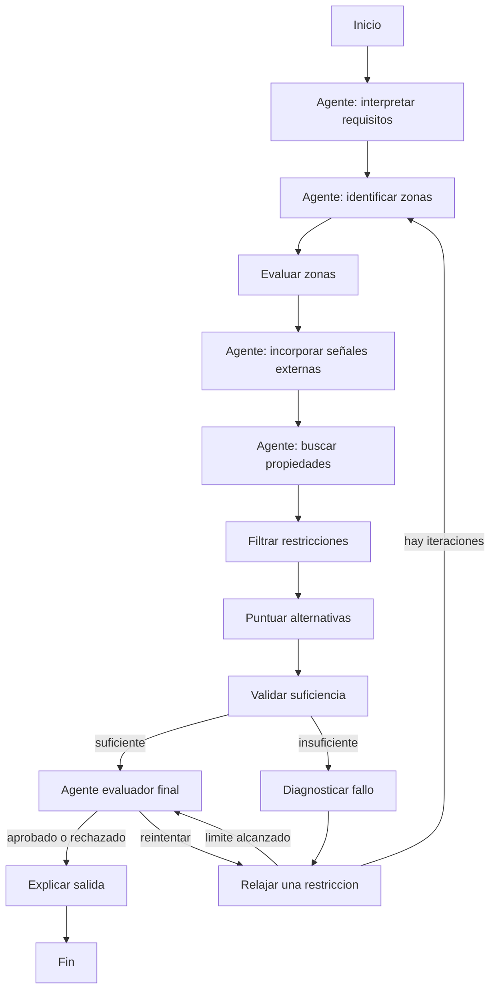

# Grafo de decision

## Transiciones

- `check_sufficiency` envia a evaluacion final si hay suficientes alternativas o si ya se alcanzo el limite de iteraciones.
- `diagnose_failure` explica por que no hay resultados adecuados antes de relajar criterios.
- `relax_constraints` modifica una sola variable por iteracion.
- `final_evaluator` aprueba, rechaza o solicita otra relajacion.
