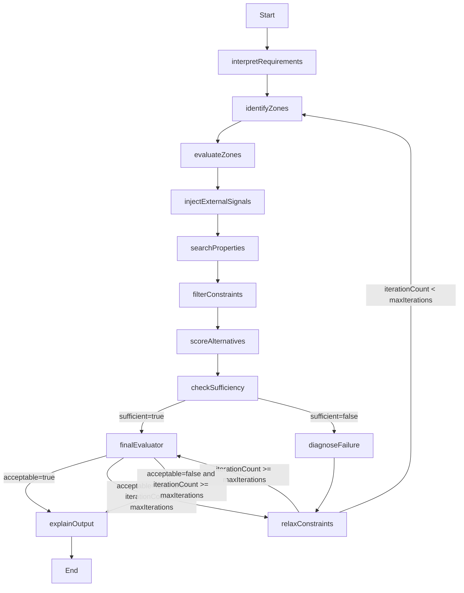

# Diagrama del grafo propuesto

## Logica de transiciones

- `check_sufficiency`: valida si existe el minimo de alternativas elegibles.
- `diagnose_failure`: identifica la causa principal cuando no hay suficiencia.
- `relax_constraints`: modifica una sola variable principal por iteracion.
- `final_evaluator`: aprueba o pide otra iteracion segun cantidad y calidad de resultados.
